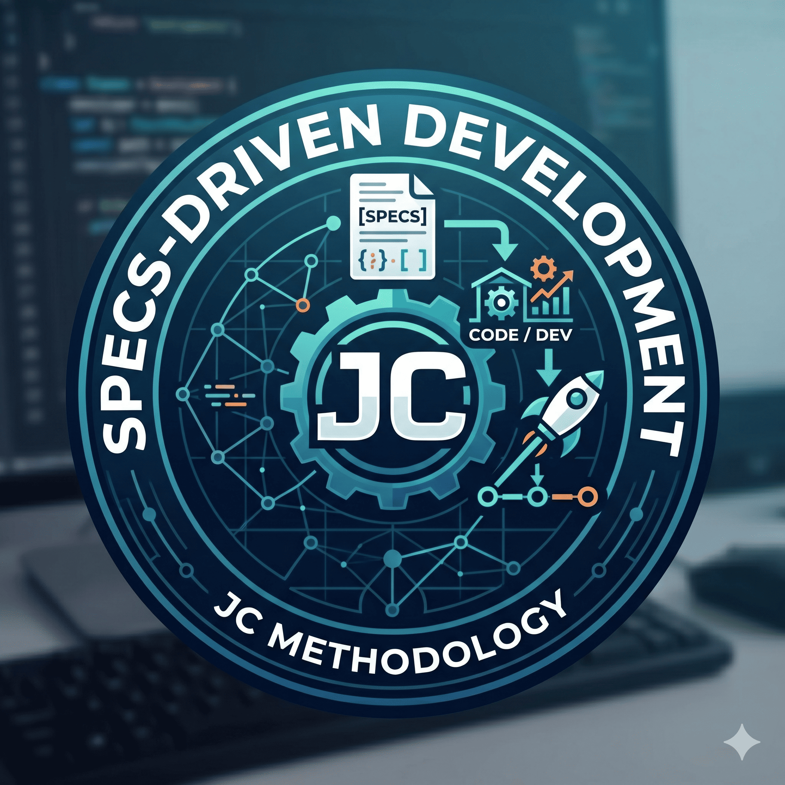

# sdd-jc-methodology



Portable Claude configuration for the SDD JC methodology.

SDD JC is a constitution-first, spec-driven methodology for AI-assisted development. It keeps product intent, UX direction, technical design, implementation tasks, tests, and validation evidence in repository documentation so humans and agents can work from the same durable context.

## Repository Structure

- `.claude/commands/` — custom SDD command prompts
- `.claude/skills/` — required and preferred skills used by the methodology
- `scripts/` — helper scripts referenced by commands (e.g. `gsc_verify.py`)
- `.mcp.json.example` — reference MCP server configuration (e.g. `gsc`)
- `dotfiles/` — environment snapshots for Neovim and tmux

## Contents

- `.claude/commands/`
  - `sdd-constitution.md`
  - `sdd-propose.md`
  - `sdd-specify.md`
  - `sdd-execute.md`
  - `sdd-test.md`
  - `sdd-validate.md`
  - `sdd-archive.md`
  - `sdd-seo.md`
- `.claude/skills/`
  - `api-design-principles`
  - `aws-serverless`
  - `brainstorming`
  - `error-handling-patterns`
  - `frontend-design`
  - `nestjs-expert`
  - `product-manager-toolkit`
  - `react-doctor`
  - `shadcn-ui`
  - `stitch-design`
  - `systematic-debugging`
  - `tailwind-design-system`
  - `ui-ux-pro-max`
  - `vercel-react-best-practices`

## Install

Install the methodology with the bundled CLI. The installer can target Claude, OpenCode, or both.

Use without installing globally:

```bash
pnpm dlx sdd-jc-methodology install
```

Install for OpenCode instead:

```bash
pnpm dlx sdd-jc-methodology install --tool opencode
```

Install for both tools:

```bash
pnpm dlx sdd-jc-methodology install --tool both
```

From a local checkout, run:

```bash
node bin/sdd-jc.js install
node bin/sdd-jc.js install --tool opencode
```

Or install globally:

```bash
pnpm add -g sdd-jc-methodology
sdd-jc install
sdd-jc install --tool opencode
```

Default targets:

```text
Claude:   ~/.claude
OpenCode: ~/.config/opencode
```

For Claude, the installer writes:

```text
~/.claude/commands/
~/.claude/skills/
~/.claude/sdd-jc/scripts/
~/.claude/sdd-jc/.mcp.json.example
```

For OpenCode, the installer writes:

```text
~/.config/opencode/commands/
~/.config/opencode/skills/
~/.config/opencode/sdd-jc/scripts/
~/.config/opencode/sdd-jc/.mcp.json.example
```

OpenCode loads global command markdown files from `~/.config/opencode/commands/` and skills from `~/.config/opencode/skills/`. Restart OpenCode after install or update so it loads the new files.

### CLI Commands

| Command | Purpose |
|---|---|
| `sdd-jc install` | Install commands, skills, and helper resources |
| `sdd-jc update` | Reinstall packaged commands, skills, and helper resources |
| `sdd-jc list` | Show packaged commands, skills, and helper resources |
| `sdd-jc doctor` | Check whether expected files are installed |

Useful options:

```bash
sdd-jc install --dry-run
sdd-jc install --tool claude --target ./.claude
sdd-jc install --tool opencode --target ./.config/opencode
sdd-jc install --tool both --claude-target ./.claude --opencode-target ./.config/opencode
sdd-jc update --force
sdd-jc update --tool both --force
sdd-jc doctor --commands-only
sdd-jc doctor --tool opencode --skills-only
```

Installer safety rules:

- existing files are skipped by default
- use `--force` to overwrite existing files
- use `--dry-run` to preview changes
- use `--tool claude`, `--tool opencode`, or `--tool both` to choose the destination
- use `--target <path>` to install a single selected tool somewhere custom
- use `--claude-target <path>` and `--opencode-target <path>` with `--tool both`

The helper resources under the target `sdd-jc/` folder support commands such as `/sdd-seo`, including the bundled Google Search Console verification helper.

### Manual Install

If you do not want to use the CLI, copy the repository `.claude/commands` and `.claude/skills` folders into your tool configuration location.

Typical global install target:

- `~/.claude/commands/`
- `~/.claude/skills/`

Typical OpenCode global install target:

- `~/.config/opencode/commands/`
- `~/.config/opencode/skills/`

Example:

```bash
cp -R .claude/commands/* ~/.claude/commands/
cp -R .claude/skills/* ~/.claude/skills/
```

Manual OpenCode example:

```bash
mkdir -p ~/.config/opencode/commands ~/.config/opencode/skills
cp -R .claude/commands/* ~/.config/opencode/commands/
cp -R .claude/skills/* ~/.config/opencode/skills/
```

## Dotfiles

The repository also includes editor and terminal configuration snapshots under `dotfiles/`:

- `dotfiles/.config/nvim/`
- `dotfiles/.tmux/`
- `dotfiles/.tmux.conf`

These are stored as portable references or backup material for the environment used with this methodology.

### Restore Neovim

```bash
mkdir -p ~/.config
cp -R dotfiles/.config/nvim ~/.config/
```

### Restore tmux

```bash
cp dotfiles/.tmux.conf ~/.tmux.conf
cp -R dotfiles/.tmux ~/.tmux
```

If you prefer a lighter restore, keep `~/.tmux.conf` and reinstall plugins separately instead of copying the full plugin snapshot.

## Start Here

Use this flow for normal feature work:

1. `/sdd-constitution` - create or strengthen the project baseline.
2. `/sdd-propose <change-name-or-spec-path>` - capture intent, scope, and reviewable direction.
3. `/sdd-specify <spec-path>` - define one feature, module, bugfix, or enhancement.
4. `/sdd-execute <spec-path>` - implement the next approved task.
5. `/sdd-test <spec-path>` - prove the behavior with tests and traceability.
6. `/sdd-validate <spec-path>` - audit conformance before calling the work done.
7. `/sdd-archive <spec-path>` - preserve completed work and remove it from active specs.

Run `/sdd-constitution` first in a new repository, after a major product pivot, or when the baseline docs are missing. For an established repository with a good baseline, start at `/sdd-propose <change-name>` or `/sdd-specify <spec-path>`.

Use `/sdd-propose` when the change needs review before full specification. For very small, obvious work, you may start directly with `/sdd-specify <spec-path>`.

## Command Map

| Command | Use When | Main Output |
|---|---|---|
| `/sdd-constitution` | Starting a repo or repairing weak project context | `docs/prd.md`, system design, detailed design, general spec templates, `CLAUDE.md` guidance |
| `/sdd-propose <change-name-or-spec-path>` | Aligning on intent before full specification | `proposal.md` under `docs/specs/<spec-path>/` |
| `/sdd-specify <spec-path>` | Planning one bounded change before code | `requirements.md`, `design.md`, `tasks.md` under `docs/specs/<spec-path>/` |
| `/sdd-execute <spec-path>` | Implementing approved tasks | Code changes, updated `tasks.md`, `execution.md` |
| `/sdd-test <spec-path>` | Adding or running test evidence | `test-report.md` with requirement-to-test traceability |
| `/sdd-validate <spec-path>` | Checking implementation against the spec | `validation-report.md` with pass, warning, failure, and remediation items |
| `/sdd-archive <spec-path>` | Closing completed work after validation | Archived spec folder under `docs/specs/archive/` with `archive-summary.md` |
| `/sdd-seo <site-domain>` | Auditing deployed SEO and Search Console state | `seo-setup-report.md`, `seo-audit-report.md` |

## How To Choose The Right Depth

Use the lightest documentation that still makes the work clear and verifiable.

| Work Type | Recommended Depth | What To Capture |
|---|---|---|
| Small bugfix or UI tweak | Lite | Problem, affected requirement, scenario, focused task, verification command |
| Normal feature | Standard | Requirements, scenarios, design decisions, task breakdown, tests |
| High-risk change | Full | Business context, alternatives, data/API contracts, rollout, risks, observability, rollback |
| Cross-cutting architecture | Full plus constitution review | Updates to project baseline docs and affected specs |

Lite mode does not skip rigor. It keeps the documents short, but every requirement still needs a testable scenario and every task still needs a done criterion.

## Core Concepts

| Concept | Meaning |
|---|---|
| Constitution | Project-wide context that should not be rediscovered every session |
| Proposal | A lightweight review document for intent, scope, options, and risks |
| Spec path | A folder under `docs/specs/` for one bounded piece of work |
| Requirement | A testable statement of expected behavior |
| Scenario | A concrete Given/When/Then example that proves a requirement |
| Design | The technical and UX approach for satisfying requirements |
| Task | A small executable unit linked to requirements and design sections |
| Report | Evidence that the implementation was tested and validated |
| Archive | Completed SDD history moved under `docs/specs/archive/` |

## Spec Folder Shape

Each feature or change should live in one folder:

```text
docs/specs/<spec-path>/
├── proposal.md           # created by /sdd-propose, optional but recommended
├── requirements.md
├── design.md
├── tasks.md
├── execution.md          # created by /sdd-execute
├── test-report.md        # created by /sdd-test
├── validation-report.md  # created by /sdd-validate
└── archive-summary.md    # created by /sdd-archive before moving
```

Choose paths that describe the domain and intent:

```text
docs/specs/loan/
docs/specs/enhancements/renewals/
docs/specs/admin/user-management/
docs/specs/bugfix/login-redirect/
docs/specs/changes/add-remember-me/
```

When `/sdd-propose add-remember-me` receives a bare change name, it defaults to `docs/specs/changes/add-remember-me/`. When it receives a nested path such as `bugfix/login-redirect`, it uses that path directly.

## Requirement Delta Preview

Proposals can include a lightweight delta preview. This makes reviews faster for brownfield work:

```markdown
## Requirement Delta Preview

### ADDED Requirements

- The system SHALL allow users to opt into extended sessions.

### MODIFIED Requirements

- Session expiration changes from a fixed timeout to configurable timeout policies.

### REMOVED Requirements

- Legacy session persistence behavior is removed after migration.
```

During `/sdd-specify`, these previews become full requirements, scenarios, design decisions, and tasks.

## Writing Good Requirements

Write requirements as behavior contracts, not implementation plans.

Use this shape when possible:

```markdown
### Requirement: Session Expiration

The system SHALL expire inactive user sessions after the configured timeout.

#### Scenario: Idle timeout

- GIVEN an authenticated user has an active session
- WHEN the session remains inactive past the configured timeout
- THEN the system invalidates the session
- AND the user must authenticate again before accessing protected pages
```

Good requirements are:

- observable by a user, system, API client, or operator
- measurable enough to test
- independent from internal class names or library choices
- linked to at least one implementation task
- covered by test evidence or an explicit accepted gap

## Review Points

Before implementation, review:

- whether the problem and scope are clear
- whether every requirement has at least one scenario
- whether design decisions explain trade-offs instead of only listing files
- whether tasks are small enough to execute independently
- whether every task has verification criteria

Before completion, review:

- whether all intended tasks are complete
- whether tests cover the key scenarios
- whether validation found unresolved failures
- whether the spec should be updated based on implementation discoveries

## Practical Example

For a new admin user-management feature:

```text
/sdd-constitution
/sdd-propose admin/user-management
/sdd-specify admin/user-management
/sdd-execute admin/user-management
/sdd-test admin/user-management
/sdd-validate admin/user-management
/sdd-archive admin/user-management
```

For a small login redirect bugfix in an established repo:

```text
/sdd-specify bugfix/login-redirect
/sdd-execute bugfix/login-redirect
/sdd-test bugfix/login-redirect
/sdd-validate bugfix/login-redirect
/sdd-archive bugfix/login-redirect
```

For a reviewable named change using the default `changes/` path:

```text
/sdd-propose add-remember-me
/sdd-specify changes/add-remember-me
/sdd-execute changes/add-remember-me
/sdd-test changes/add-remember-me
/sdd-validate changes/add-remember-me
/sdd-archive changes/add-remember-me
```

## Planned Improvements Inspired By OpenSpec

OpenSpec has useful ideas that fit this methodology well. Some are now supported through `/sdd-propose` and `/sdd-archive`. Remaining planned improvements:

- automated sync lifecycle for completed specs
- schema-style workflow templates for feature, bugfix, migration, SEO, and research-first work
- broader command portability beyond Claude-specific command files

### Auxiliary commands

- `/sdd-seo <site-domain>` — SEO setup & audit via Google Search Console. Verifies a domain through DNS TXT using a service account, adds the property to GSC, then audits index coverage, sitemaps, structured data, search analytics, server-side render, and internal linking. Produces `seo-setup-report.md` and `seo-audit-report.md` under `docs/specs/seo/<domain>/`, including a copy-paste implementation prompt for fixing every High-severity finding.

  Dependencies bundled with this repo:

  - `scripts/gsc_verify.py` — Site Verification API helper (token + verify), because the `gsc` MCP only wraps Search Console, not Site Verification.
  - `.mcp.json.example` — reference MCP server entry for `@mikusnuz/gsc-mcp`.

  Setup once per environment:

  1. Enable **Site Verification API** and **Search Console API** in your Google Cloud project.
  2. Create a service account, download its JSON key, store outside the repo.
  3. Install Python deps: `pip install google-auth google-api-python-client`.
  4. Copy the `gsc` block from `.mcp.json.example` into your global `~/.claude.json` (or a project `.mcp.json`) and set `GSC_SERVICE_ACCOUNT_KEY_PATH` to the absolute path of the key.

## Spec Paths

Commands accept a relative path under `docs/specs/`, not only a flat module name.

Examples:

- `loan`
- `enhancements/renewals`
- `admin/user-management`

## Dependencies

Included skills cover the default methodology path, including `ui-ux-pro-max`.

Fallback rule:

- when `ui-ux-pro-max` is unavailable, use `frontend-design` + `stitch-design` for system-design work and `frontend-design` for UI validation/testing support.

## Methodology Contract

- `/sdd-constitution` establishes the project baseline docs and `docs/specs/general-setup/` templates.
- `/sdd-propose` creates a lightweight proposal before full specification.
- `/sdd-specify` must follow those templates when generating module specs.
- `/sdd-execute` implements tasks from an approved spec path.
- `/sdd-test` validates requirement-to-test traceability.
- `/sdd-validate` audits implementation conformance against the spec and constitutional baseline.
- `/sdd-archive` preserves completed specs under `docs/specs/archive/` after validation.
- `/sdd-seo` operates outside the main spec lifecycle: it provisions Google Search Console ownership for a domain and produces a standalone SEO audit under `docs/specs/seo/<domain>/`. Run it any time after deployment; rerun after major content or schema changes.

## Host Assumptions

- The host Claude environment can ask follow-up questions to the user during command execution.
- The host environment can load local skills referenced by the commands.
- Repository-specific build, lint, and test commands should be preferred over hardcoded stack assumptions.

## Notes

- Commands were sourced from the current global Claude command setup.
- Skills were copied with their bundled references and helper assets.
- This repository stores the current methodology baseline so it can be reused or versioned independently.
- Dotfiles are snapshots of the working environment and may include plugin source copies for portability.
