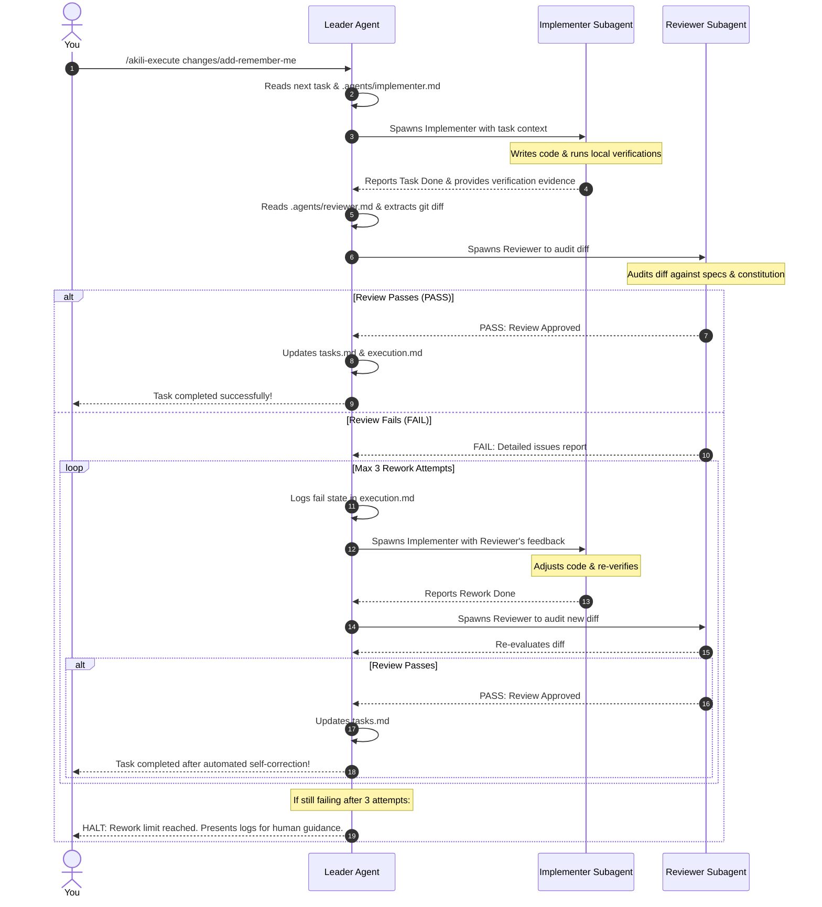

# Design Document: AKILI Multi-Agent AKILI-SPECS Orchestration
**Date:** 2026-05-26  
**Topic:** Multi-Agent AKILI-SPECS Orchestration (Leader-Implementer-Reviewer Triad)  
**Status:** Approved  

---

## 1. Executive Summary

This document specifies the integration of a specialized **Leader-Implementer-Reviewer** agentic team into the AKILI Spec-Driven Development (AKILI-SPECS) methodology. 

By shifting from a single-agent execution model to a collaborative, multi-agent triad, AKILI eliminates confirmation bias during code reviews, improves context window efficiency, and guarantees high-fidelity compliance with system design tokens and the project's constitution (`CLAUDE.md`/`AGENTS.md`).

---

## 2. Agent Roles & Folder Structure

We define a hidden directory `.agents/` in the project root to serve as the unified source of truth for the local developer team:

```text
your-workspace/
├── .agents/
│   ├── leader.md        # Orchestration logic, task tracking, and links to CLAUDE.md/AGENTS.md
│   ├── implementer.md   # Focused coding guidelines, testing standards, design token extraction
│   └── reviewer.md      # Spec conformance audits, lint/type checks, and design token compliance
```

### Agent Personas
1.  **Leader Agent (Orchestrator):** Coordinates the execution, parses `tasks.md`, spawns subagents, monitors retries, and records execution history inside `execution.md`.
2.  **Implementer Agent (Coder):** Natively equipped with write tools to create and edit files, compile code, and run tests. Focuses strictly on the active task.
3.  **Reviewer Agent (Auditor):** Natively equipped with read/diff tools. Does **not** modify code. Evaluates the Implementer's diff against requirements, detailed designs, and global style guides.

---

## 3. The Smart Constitution Phase (`/akili-constitution`)

During the constitution phase, the Leader dynamically classifies the repository and sets up the agentic environment without destroying existing configurations:

1.  **Brand New Project (Seed Setup):** Prompts the user for a seed intent, initializes directories, drafts initial baselines (`prd.md`, `design.md`, `detailed-design.md`), and scaffolds the default `.agents/` templates.
2.  **Legacy Codebase (Discovery Setup):** Deep scans the codebase using CodeGraph or grep to extract components, API contracts, and styling tokens. Synthesizes baselines from this codebase reality and customizes the `.agents/` guidelines matching this tech stack.
3.  **Active AKILI-SPECS Project (Safe Update):** Reads existing files and custom subagent rules. **It does not overwrite them.** It only upgrades weak sections and updates `.agents/` to support the new multi-agent loop while preserving custom instructions.

---

## 4. Automated Rework Loop (`/akili-execute`)

When `/akili-execute` is triggered, the Leader automatically coordinates the subagent loop in the background:



### Rework Loop Guardrails
*   **Maximum Retries:** A hard ceiling of **3 rework attempts** is enforced to prevent infinite loops and token waste.
*   **Structured Feedback:** The Reviewer outputs a structured three-part report: *Discovered Issue*, *Violated Rule*, and *Remediation Suggestion* to guide the Implementer directly.
*   **Escalation:** If the loop fails all 3 retries, the Leader halts and presents the audit trails for human intervention.

---

## 5. Unified Cross-Tool Compatibility Specs

The `.agents/` directory is standardized to be completely tool-agnostic:

*   **Markdown Frontmatter:** Uses pure Markdown + YAML frontmatter, natively compatible with Antigravity, Claude Code, and OpenCode.
*   **Standard Path Resolution:** All AKILI commands resolve the `.agents/` path relative to the active terminal's **Current Working Directory (Cwd)**, binding it strictly to the current workspace.
*   **Subagent Adaptations:**
    *   *Antigravity:* Calls `invoke_subagent` using prompts read from `.agents/`.
    *   *Claude Code / OpenCode:* Delegates tasks by triggering sub-prompt contexts seeded with the extracted implementer/reviewer instructions.
